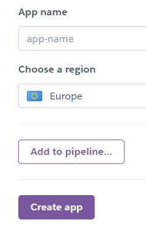
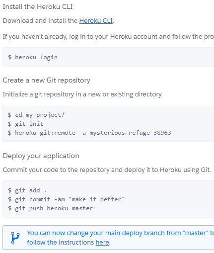
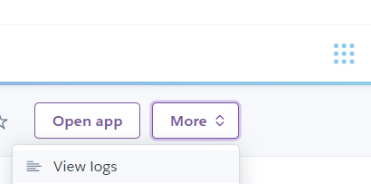
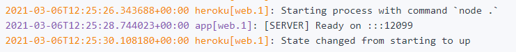

To let players to connect with each other, the GWS server have to be hosted on a cloud machine. This tutorial will guide on deploying the server on the service [Heroku](https://heroku.com), which offers a free plan to get started.

Other solutions are also available, e.g. AWS, Google Cloud, Digital Ocean, self hosting, etc.. 

---

1. Go on [Heroku](https://signup.heroku.com) and follow the procedure to create an account.

2. Once you are logged in, click on _Create an app_

3. Type your app name and select a region, then click the button _Create app_.

4. Go to the _Deploy_ tab and follow the procedure to upload the server code with the Heroku CLI and Git. If you haven't got _Git_ already, please install it first from this [link](https://git-scm.com/downloads).

5. If everything went smoothly, your server will now be running on the address `<your-app-name>.herokuapp.com`, which will be the address to connect from within the game (instead of `http://localhost:8080`). 

---

Note: to confirm that the server is up and running, go to the app logs and check that the server is started.

