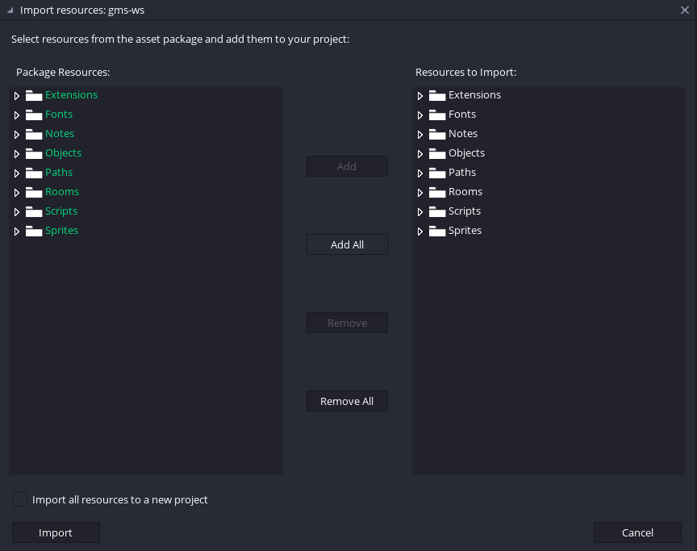
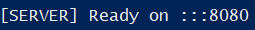

### Install the client (GameMaker Studio)

1. Download the extension from https://github.com/wsnet-lib/gms-client and unzip it.

2. Run Game Maker Studio and import the file _gws_2_3.yymps_ (by dragging the file on the editor and importing all resources)



3. There you go, the game will now be able to connect to your multiplayer server on your machine. If you want to test the connection, please proceed with the server installation.

---

### Install the client (Unity)

@TODO

---

### Install the server

1. Download the server from https://github.com/wsnet-lib/server and unzip it.

2. Install Node.js from https://nodejs.org/en

3. In the server folder, open a terminal window (eg. PowerShell) and run:

```bash
$ npm install
$ npm run watch
```

This will install the dependencies and run the server on your local machine. If everything went smoothly, you will see:



4. You are now ready to test the game connection from GameMaker Studio
